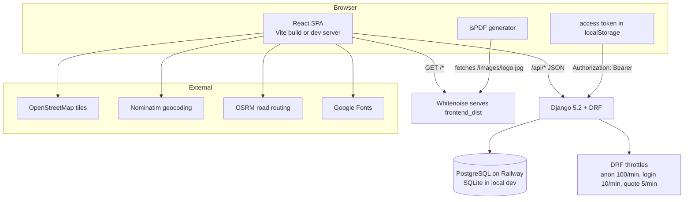

# 01 — Architecture

## System diagram

## Serving model

- **Dev:** Vite (5173) serves the SPA and proxies `/api` → Django (8000). Same-origin for the browser, so CORS is never triggered.
- **Prod (Railway):** one Django service.
  - `vite build` outputs to `backend/frontend_dist`
  - Whitenoise (`WHITENOISE_ROOT`) serves that build at the root URL, including `/images/*`
  - `config/urls.py` ends with a catch-all: `^(?!api/|admin/|static/).*$` → `index.html` (SPA routing)
  - `collectstatic` only covers Django admin static

## Request flow (admin example)

1. `POST /api/auth/login/` → throttled (10/min) → SimpleJWT access+refresh
2. SPA stores tokens in `localStorage`; `api.js` interceptor adds `Authorization: Bearer <access>`
3. On 401 the interceptor tries `POST /api/auth/login/refresh/` once, then redirects to `/admin/login`
4. Business endpoints check `IsAuthenticated` and (where needed) `role == super_admin`
   (`accounts/views.py:IsSuperAdmin`)

## Key cross-cutting mechanisms

| Mechanism | File |
|---|---|
| JWT auth + refresh interceptor | `frontend/src/api.js` |
| Role checks | `backend/accounts/views.py` |
| Inventory sync on status change | `backend/orders/serializers.py:apply_inventory_on_status_change` |
| Public vs admin item serializers | `backend/inventory/serializers.py`, `views.py:get_serializer_class` |
| Customer merge (orders + manual pins) | `backend/orders/views.py:CustomerSearchView` |
| Branded PDFs | `frontend/src/pdf/quotePdf.js` |
| 3D hero (R3F, offline studio env) | `frontend/src/components/Hero3D.jsx` |
| Delivery map (pins/directions/trend) | `frontend/src/pages/admin/DeliveryMap.jsx` |

## Configuration surface

All env-driven settings live in `backend/config/settings.py`:

| Env var | Purpose | Default (dev) |
|---|---|---|
| `DJANGO_SECRET_KEY` | signing key; **required in prod** | insecure dev key |
| `DJANGO_DEBUG` | debug mode | `true` |
| `DJANGO_ALLOWED_HOSTS` | CSV of hosts; **required in prod** | `*` |
| `DJANGO_CORS_ORIGINS` | CSV of allowed CORS origins | localhost dev origins |
| `DATABASE_URL` | Postgres URL on Railway (via dj-database-url) | SQLite `db.sqlite3` |

See `docs/08-DEPLOYMENT.md` for Railway wiring and `docs/09-SECURITY.md` for the guards.
