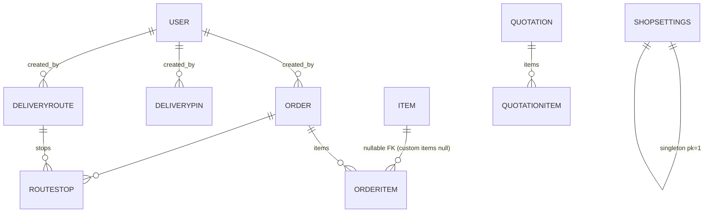

# 04 — Database Design

Engine: SQLite in local dev; **PostgreSQL on Railway** (via `DATABASE_URL`).
Migrations: `accounts/0001` · `inventory/0001-0002` · `orders/0001-0005` ·
`quotations/0001-0003`.

## ER overview



## Tables & fields

### accounts_user (custom AbstractUser)
`username` (150, unique), `password`, `first_name`, `last_name`, `email`,
`role` (`super_admin`|`admin`), plus inherited Django fields
(`is_staff`, `is_active`, `date_joined`, …).

### inventory_item
`name` (150) · `category` (choices: chairs, tables, linens, covers, tents,
sound_light, decor, glassware, other) · `quantity_on_hand` · `quantity_in_use` ·
`condition` (good/used/worn) · `color` · `size` · `rental_price` dec(12,2) ·
`low_stock_threshold` · `photo_url` (255, path to `/images/...`) · `notes` ·
timestamps.
Computed: `quantity_available = on_hand - in_use (min 0)` · `is_low_stock`.

### orders_order
`customer_name` (150) · `contact_number` (30) · `email` · `event_type` (80) ·
`event_date` · `event_time` · `delivery_address` (text) · `lat/lng` dec(10,7) ·
`status` (pending/confirmed/out_for_delivery/delivered/completed/cancelled) ·
`delivery_date` · `delivered_at` · `inventory_applied` (bool) · `total_price`,
`discount`, `deposit` dec(14,2) · `notes` · `created_by` FK user · timestamps.
Computed: `balance = total - deposit`.

### orders_orderitem
`order` FK (CASCADE, related `items`) · `item` FK **nullable** (PROTECT;
null = custom equipment) · `custom_name` (150) · `quantity` · `quantity_returned` ·
`unit_price` dec(12,2) · `notes` (200).
Computed: `display_name = custom_name or item.name` · `quantity_missing = qty - returned`.

### orders_shopsettings
Singleton (pk=1): `address`, `lat/lng` dec(10,7), `updated_at`.

### orders_deliverypin
`label` (150, blank) · `address` · `lat/lng` dec(10,7) · `pin_date` · `notes` ·
`created_by` FK user · `created_at`.

### orders_deliveryroute / orders_routestop
Route: `route_date`, `name` (150), `notes`, `created_by`, timestamps.
Stop: `route` FK (CASCADE, related `stops`), `name` (150), `phone` (30),
`address`, `lat/lng`, `seq`, `notes` (200), `order` FK nullable.

### quotations_quotation / quotations_quotationitem
Quotation: `name` (150) · `phone` (30) · `email` · `event_type` (80) ·
`event_date` · `venue` (200) · `items_requested` (text) · `message` ·
`status` (new/replied/closed) · `source` (web/manual) · `reply` (text) · `created_at`.
Item: `quotation` FK (CASCADE, related `items`), `description` (200), `quantity`,
`unit_price` dec(12,2), `price_na` (bool). Computed: `amount` → None when `price_na`.

## Inventory sync state machine

Implemented in `backend/orders/serializers.py:apply_inventory_on_status_change`
(also documented in docs/02). Custom items (`item IS NULL`) never touch stock.

## Row-Level Security (PostgreSQL only)

**Status: ENABLED** via migration `orders/0005_row_level_security` (no-op on SQLite;
runs the DO block on PostgreSQL).

Design note: this is a **single-tenant** app. "Row-level" here means
**database-role-based table protection**, not per-tenant row keys:

- `ENABLE ROW LEVEL SECURITY` + `FORCE ROW LEVEL SECURITY` on all 10 business tables
  (`accounts_user`, `inventory_item`, `orders_order`, `orders_orderitem`,
  `orders_shopsettings`, `orders_deliverypin`, `orders_deliveryroute`,
  `orders_routestop`, `quotations_quotation`, `quotations_quotationitem`).
- Policy `app_full_access` grants `FOR ALL TO <current_user> USING (true) WITH CHECK (true)`
  — the Railway app role (table owner) keeps working, but `FORCE` means **every** role,
  including the owner, must pass a policy. Any other DB role with CONNECT rights is
  denied by default.
- Django system tables (migrations, sessions, contenttypes) are intentionally excluded.

### Verify on Railway (psql)

```sql
SELECT relname, relrowsecurity, relforcerowsecurity
FROM pg_class WHERE relname IN ('orders_order','inventory_item');  -- t | t

SELECT tablename, policyname, roles FROM pg_policies WHERE policyname='app_full_access';
```

### Future multi-tenant path (documented, not implemented)
Add a `tenant_id` FK to business tables, change the policy to
`USING (tenant_id = current_setting('app.tenant_id')::bigint)`, and set the GUC
in a Django DB wrapper. Not needed for the single business today.

## Data hygiene notes

- `seed_pricelist` upserts by item **name** — renaming an item creates a new row.
- Deleting an `Item` with orders fails (FK PROTECT).
- `OrderItem.item` null → custom equipment; shown via `display_name` everywhere.
